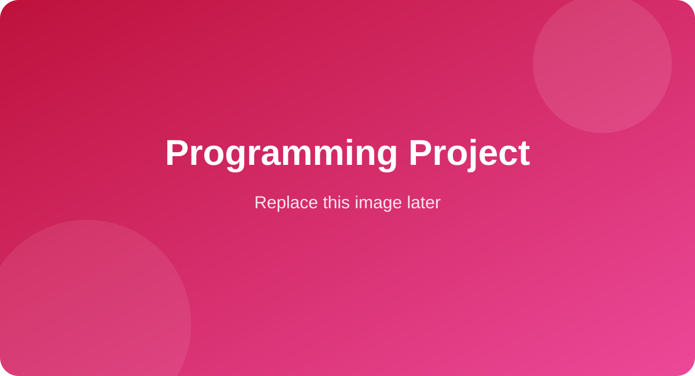

<!--
=========================================================
ASMA AL-MALIKI — GitHub Profile README
غيّري فقط:
1) YOUR-USERNAME إلى اسم مستخدم GitHub الخاص بك.
2) روابط المشاريع.
3) أوصاف المشاريع.
4) استبدلي الصور داخل مجلد images مع إبقاء الأسماء نفسها.
=========================================================
-->

# ASMA AL-MALIKI

### A Showcase of My Best Work!

Computer Science Student · AI & Data Enthusiast · Problem Solver

 

---

## Featured Projects

A selection of projects that represent my best work, skills, and learning journey.

<table>
<tr>
<td width="50%" valign="top">

### Predictive Maintenance Agent

An AI agent that analyzes industrial sensor data, detects anomalies, predicts potential failures, and recommends maintenance actions.

**Tools:** Python · Machine Learning · Excel · Hermes

[View Project →](https://github.com/YOUR-USERNAME/predictive-maintenance-agent)

</td>
<td width="50%" valign="top">

### Data Analysis Project

A data analysis project focused on cleaning, exploring, and visualizing data to uncover meaningful insights and support decisions.

**Tools:** Python · Pandas · Excel · Data Visualization

[View Project →](https://github.com/YOUR-USERNAME/data-analysis-project)

</td>
</tr>

<tr>
<td width="50%" valign="top">

### Power BI Dashboard

An interactive dashboard designed to present key metrics, trends, and insights in a clear and organized visual format.

**Tools:** Power BI · Excel · Data Cleaning · Dashboards

[View Project →](https://github.com/YOUR-USERNAME/power-bi-dashboard)

</td>
<td width="50%" valign="top">

### Programming Project

A software project demonstrating logical thinking, problem-solving, clean code, and practical programming skills.

**Tools:** C++ · Python · Algorithms · Problem Solving

[View Project →](https://github.com/YOUR-USERNAME/programming-project)

</td>
</tr>
</table>

---

### Skills & Technologies

 

*Learning, building, and improving one project at a time.*

