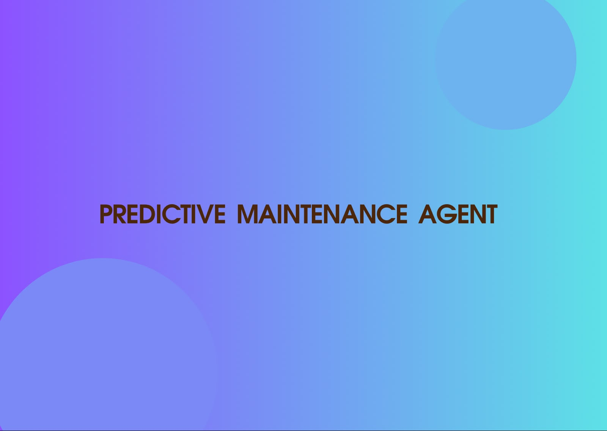
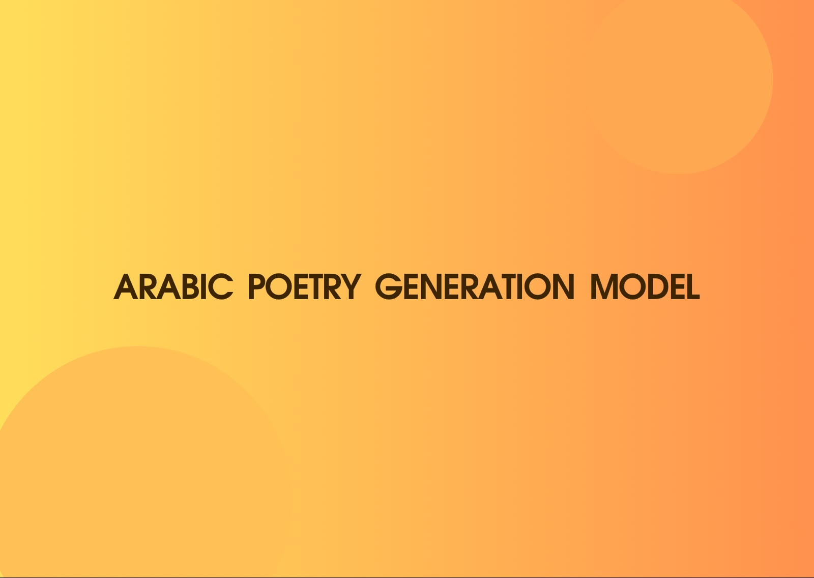

<!--
Asma Almalki — GitHub Profile README
غيّري فقط:
1) روابط المشاريع.
2)أوصاف المشاريع.
3)استبدال صور داخل مجلد images مع إبقاء الأسماء نفسها.

-->

  
# Asma Almalki

   
 

  &#8287;&#8287;&#8287;&#8287;&#8287;
  &#8287;&#8287;&#8287;&#8287;&#8287;
  

---

## Featured Projects

A selection of projects that represent my best work, skills, and learning journey.

<table>
<tr>
<td width="50%" valign="top">

......................................................................................

**Tools:**...............................

</td>
<td width="50%" valign="top">

....................................................................................

**Tools:**......................................

</td>
</tr>

<tr>
<td width="50%" valign="top">

............................................................................

**Tools:** ...................

</td>
<td width="50%" valign="top">

................................

**Tools:** ....................

</td>
</tr>
</table>

---

### Skills & Technologies

 

*Learning, building, and improving one project at a time.*

